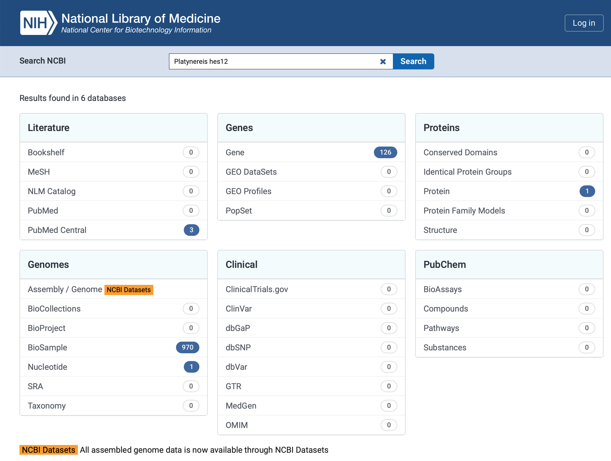
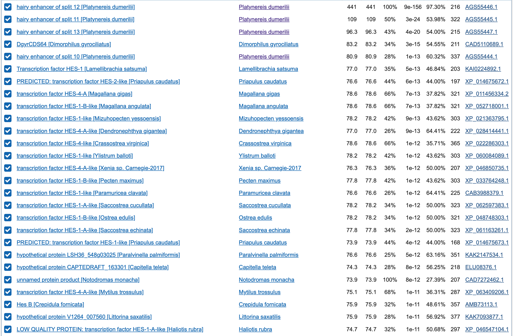
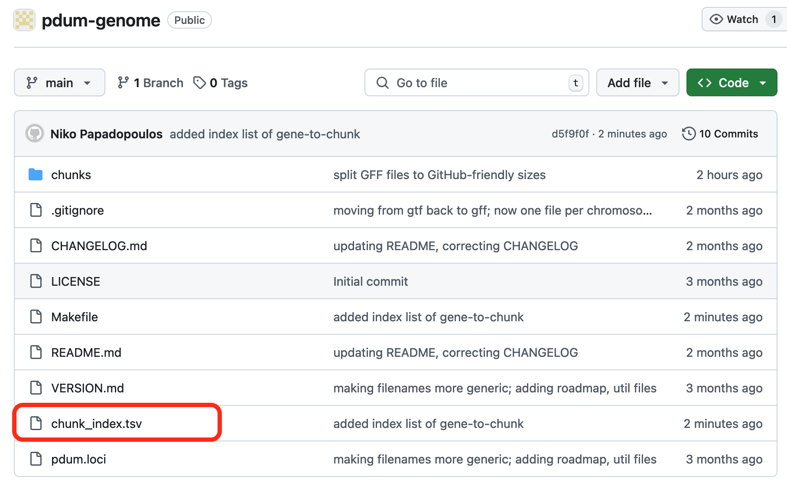
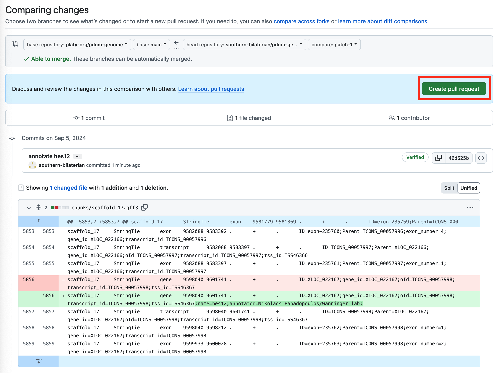

# Contributing to the _Platynereis dumerilii_ genome annotation

#### Niko Papadopoulos, 2024-09-05

> [!TIP]
> This is intended to be a step-by-step walkthrough of **one** of the possible ways you could
> contribute. Use your sound scientific judgement and whatever equivalent tools you prefer. The part
> of this document that will probably always be relevant is the GitHub submission process.

> [!NOTE]
> There is a _lot_ to take into account when naming genes, and as of the writing of this document
> there is no consensus on how to do it for _Platynereis dumerilii_. This discussion, while very,
> very important, is beyond the scope of this document.

## 1. Find your gene(s) of interest

In this document I will be trying to annotate exactly one gene; I will go and take a published
_Platynereis_ sequence from a peer-reviewed journal, find it on the genome, and propose a name for
it. This is the easiest case, where someone else has done the hard work of calculating the
phylogenetic trees and actually proposing a name for the sequence. Here I will just make sure that
I find an XLOC that represents this known gene beyond reasonable doubt.

I have a soft spot for _hes12_, a gene that (among other things) marks the [chaetoblast cells at the
base of the chaetal
sac](https://evodevojournal.biomedcentral.com/articles/10.1186/2041-9139-5-29/figures/14). I know
that there is an [excellent publication that includes this
gene](https://evodevojournal.biomedcentral.com/articles/10.1186/2041-9139-5-29), where the
phylogenetic work has already been done. All I need is to find the sequence of _hes12_ according to
Gazave _et al._ and find it on the genome.

The sequence was uploaded on GenBank, which means an NCBI search should do the trick:



and [it does](https://www.ncbi.nlm.nih.gov/protein/529156849).

## 2. Find the gene on the genome

<details>
<summary>DIY: Making your own local sequence search server</summary>

If there is a type of search you do often, it might be worth setting up your own local sequence
search server. For this, I recommend the MMSeqs2 app. It is not maintained any more, but one of the
[latest releases](https://github.com/soedinglab/MMseqs2-App/releases/tag/v7-8e1704f) should still
work plenty well. If you download and install the app, you can then create a database out of any
FASTA file; for instance the pdum-v2.1 predicted proteome.

</details>

To do this you could build your local sequence search server, or you could just use the Jekely lab
[online BLAST tool](https://jekelylab.ex.ac.uk/blast/), which allows the v0.2.1 **transcriptome** to
be used as a reference. I will paste the sequence of _hes12_ into the query box and hit "BLAST".

The results look good:

```
# TBLASTN 2.9.0+
# Query: AGS55446.1 hairy enhancer of split 12 [Platynereis dumerilii]
# Database: /data/jekely_lab/db/Platynereis/pdumv021.transcripts.fa
# Fields: query id, subject id, subject sci names, % identity, alignment length, mismatches, gap opens, q. start, q. end, s. start, s. end, evalue, bit score, % query coverage per subject, % query coverage per hsp
# 15 hits found
AGS55446.1	TCONS_00057998	N/A	91.892	222	12	1	1	216	141	806	3.08e-109	327	100	100
AGS55446.1	TCONS_00057999	N/A	89.944	179	12	1	44	216	1	537	6.88e-76	239	80	80
AGS55446.1	TCONS_00058002	N/A	53.982	113	41	2	6	118	149	454	2.10e-26	108	52	52
AGS55446.1	TCONS_00058001	N/A	53.982	113	41	2	6	118	149	454	2.30e-26	108	52	52
AGS55446.1	TCONS_00058705	N/A	54.000	100	30	3	3	99	134	394	5.64e-22	95.9	45	45
AGS55446.1	TCONS_00057996	N/A	60.317	63	25	0	5	67	159	347	2.22e-16	80.1	29	29
AGS55446.1	TCONS_00058703	N/A	50.000	72	36	0	3	74	167	382	5.56e-13	70.1	33	33
AGS55446.1	TCONS_00047673	N/A	43.284	67	38	0	10	76	319	519	7.86e-12	67.0	31	31
AGS55446.1	TCONS_00047672	N/A	43.284	67	38	0	10	76	319	519	7.87e-12	67.0	31	31
AGS55446.1	TCONS_00158255	N/A	53.704	54	25	0	10	63	174	335	2.24e-11	65.5	25	25
AGS55446.1	TCONS_00068250	N/A	44.776	67	37	0	10	76	368	568	1.37e-10	63.2	31	31
AGS55446.1	TCONS_00145417	N/A	47.692	65	30	1	7	67	41	235	1.48e-10	62.4	28	28
AGS55446.1	TCONS_00047614	N/A	39.683	63	38	0	7	69	360	548	5.57e-07	52.8	29	29
AGS55446.1	TCONS_00163643	N/A	42.857	56	30	1	8	63	366	527	4.32e-06	50.1	26	26
AGS55446.1	TCONS_00163642	N/A	42.857	56	30	1	8	63	366	527	4.46e-06	50.1	26	26
# BLAST processed 1 queries
```

There is a clear most prominent hit for TCONS_00057998, which, according to the graphical view
belongs to XLOC_022167. This is then where I should be looking.

## 3. Verify the XLOC of interest

The _hes12_ sequence contains a lot of X's. To make sure that what we are seeing here is a real
protein that really is part of the hes/hey family, I will copy the XLOC_022167 sequence from the
alignment file (better still: get it from the predicted proteome) and BLAST it on NCBI. A quick
`blastp` later, I see that my fear was unfounded.



The various _Platynereis_ sequences are top hits, followed by other annelids and further
lophotrochozoans. It is hard to say whether getting mostly Hes1/4 hits is good or bad, because the
phylogeny of the family is notably [fuzzy outside of
vertebrates](http://www.ncbi.nlm.nih.gov/pmc/articles/PMC3396596). If I were a real expert in this
topic, I might have strong opinions about this, or have done analyses to suggest /confirm/deny more.
As I am not, I will be happy that the sequence expertly identified as Hes12 for _Platynereis_ is
present in the genome, covered to 100%, and readily identified as a member of the family in the 
reverse search.

## 4. Find the gene in the GFF

The goal is to find the gene that has "XLOC_022167" as its unique identifier, and then append some
information about the gene to that particular line. There is no need to edit any other fields of the
gene/CDS/exon definition, as that would just be redundant. Most programs that interact with GFF3
files are smart enough to propagate info from the "gene" line to all the nested elements that come
below that.

Having made a fresh GitHub account, I will no go and find XLOC_022167.

First, I will navigate to the [pdum-genome repository](https://github.com/platy-org/pdum-genome).

Second, I will click on the "chunk_index.tsv" file...



...and then on "View raw", since the file is too big to display:


This file is simply a TSV table of all gene loci in the genome, as well as the file and line they
are in. A simple search (`Ctrl + F` on Windows/Linux, `Cmd + F` on MacOS) for "XLOC_022167" reveals
that we should be able to find it on line 5856 of file `scaffold_17.gff3` in the `chunks/`
directory.

## 5. Edit the GFF

Now comes the critical step: I will then navigate to chunks/scaffold_17.gff3 and press on the pencil
icon on the top right corner:


Since I am not a member of the repository, I will be prompted to fork it. I will do so (press the
green button, or maybe learn about forks first and then press the green button).

This will open an editor view of the file. I will scroll down to line 5856, where I see the
following line:

```
5856:scaffold_17	StringTie	gene	9598040	9601741	.	+	.	ID=XLOC_022167;gene_id=XLOC_022167;oId=TCONS_00057998;transcript_id=TCONS_00057998;tss_id=TSS46367
```

Great, we found it! Now I will add some more colon-separated fields at the end:

```
5856:scaffold_17	StringTie	gene	9598040	9601741	.	+	.	ID=XLOC_022167;gene_id=XLOC_022167;oId=TCONS_00057998;transcript_id=TCONS_00057998;tss_id=TSS46367,name=hes12;annotator=Nikolaos Papadopoulos/Wanninger lab;
```

I have added two new fields: `name=hes12` and `annotator=Nikolaos Papadopoulos/Wanninger lab`. The
first one is the gene name, and should need no further explanation. The second one is the name of
the person who made the change (me) and their current affiliation (Wanninger lab), which is going to
be useful when we want to attribute changes to the genome to specific people.

> [!CAUTION]
> GFF files are mostly meant to be read by computers, not humans; hence, it is very important that
> we adhere to the formatting rules. For the "attributes" field, that we are currently editing, the
> format is supposed to be `key1=value1;key2=value2;...`. The keys are case-sensitive, so
> `Name=hes12` is different from `name=hes12`. It is also very important that there are no spaces in
> the wrong places: `name=hes12` is correct, `name = hes12` is not; similarly,
> `ID=XLOC_022167;gene_id=XLOC_022167;` is correct, but `ID=XLOC_022167; gene_id=XLOC_022167;` is
> not. Spaces are permitted if they are part of the value, as in `annotator=Nikolaos Papadopoulos`.

## 6. Submit the pull request

After I'm done editing, I will press the green button on the top right "Commit changes...". This
will open a "Propose changes" dialogue, where I should write a brief description of what I did.


After I press the "Propose changes" button, I am taken to another page where I can review what I
just did. The page shows the line I edited, highlighting the changes, and gives me one last chance
to correct mistakes. It also encourages me to "Create pull request".



Clicking this will take me to one final page where I can review my explanation. This gives me more
formatting options, such as including links (to the paper, to figures, to analysis results, etc.).
Here, it is preferable to include as much information as possible, similar to what I have outlined
to describe my process here. It is also a good idea to upload your analysis to a place where they
will be permanently accessible, such as [Zenodo](https://zenodo.org/) or
[Figshare](https://figshare.com/).

## 7. Discuss the pull request

Finally, you can find the completed Pull Request
[here](https://github.com/platy-org/pdum-genome/pull/2). Anybody with a GitHub account can comment
on that page, which means you can express your support for my analysis or your constructive
criticism of it. Eventually, the maintainers of the repository will decide whether to accept my
proposal ("merge" the pull request) or not; I might have to take some community suggestions and
improve my analysis before that happens.